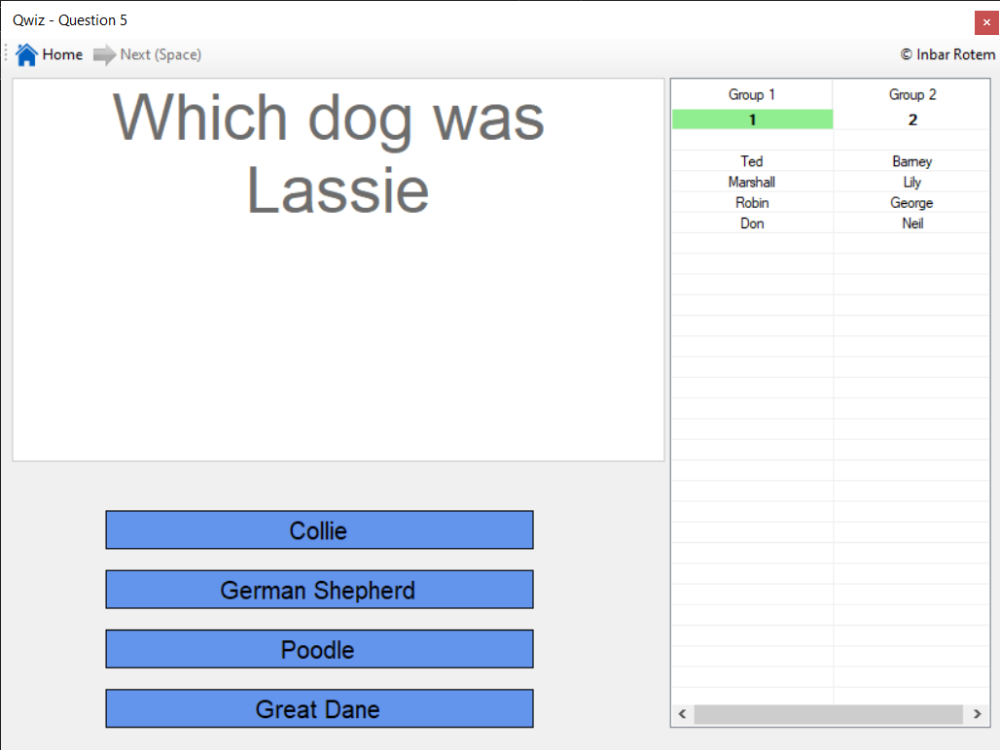

# Qwiz
An easy to make multiple answer Quiz

1. Copy the question file template (according to language), paste it in the same folder as Qwiz.exe and rename it to Questions.xlsx.
2. Add your questions in Questions sheet (the correct should be the first one). The answers will appear in random order.
3. Add the groups team members in the Groups sheet (you can add more than two groups)
4. Run the exe. Press Questions to open excel file. Press Start to start the game.

Enjoy.
